# Log-Based--IDS-Lite

A host-based intrusion detection system for Linux. It monitors system log sources in real time, applies stateful detection rules, and stores alerts in a local database. The engine runs as a background systemd service that starts automatically on boot. When you want to review alerts, open the web dashboard in your browser.

```
http://127.0.0.1:8888
```

Or click **IDS Dashboard** in your application menu.

---

## Table of Contents

1. [How It Works](#how-it-works)
2. [Requirements](#requirements)
3. [Warnings and Considerations](#warnings-and-considerations)
4. [Installation](#installation)
5. [Managing the Service](#managing-the-service)
6. [Opening the Dashboard](#opening-the-dashboard)
7. [Detection Coverage](#detection-coverage)
8. [Enabling Audit Rules](#enabling-audit-rules)
9. [Simulating Attacks](#simulating-attacks)
10. [Configuration](#configuration)
11. [Uninstalling](#uninstalling)
12. [Known Limitations](#known-limitations)

---

## How It Works

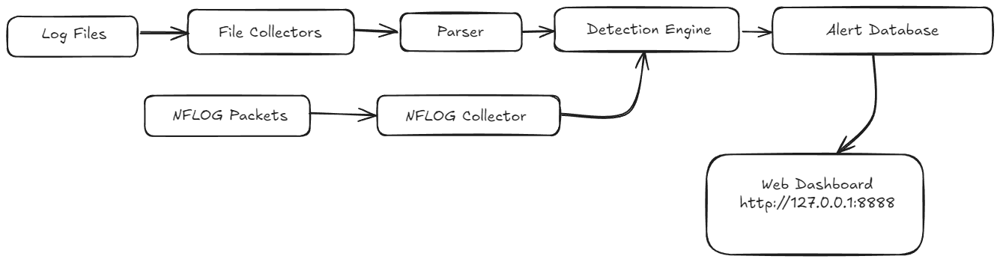


- **Collectors** tail log files (`auth.log`, `kern.log`, `audit.log`, `access.log`) and capture kernel netfilter packets via NFLOG for firewall events.
- **Parser** normalises raw log lines into structured events with source, program, event type, and context fields.
- **Detection Engine** applies 41 stateful rules across 6 source types using sliding windows, cooldowns, and cross-event correlation.
- **Alerts** are stored in a local SQLite database at `/opt/ids/data/ids.db`.
- **Dashboard** is a web interface served on loopback only — `127.0.0.1:8888`.

---

## Requirements

| Requirement | Notes |
|-------------|-------|
| **OS** | Ubuntu 22.04 or 24.04 LTS, 64-bit. Other systemd-based Debian distros may work. |
| **Privileges** | Must run as root — NFLOG capture and iptables insertion require `CAP_NET_ADMIN`. |
| **Go** | 1.21 or later — `sudo apt install golang-go` |
| **auditd** | For audit-based detections — `sudo apt install auditd` |
| **UFW** | For firewall detections — `sudo apt install ufw` |
| **iptables** | For NFLOG outbound capture — installed by default on Ubuntu |
| **Web server** *(optional)* | For web attack detections — `sudo apt install apache2` |

---

## Warnings and Considerations

### Ethical and Legal Use

This software is developed as an academic project for educational purposes. It is intended to be installed and operated **only on systems you own or have explicit written permission to monitor**.

- Running an IDS on a system without authorisation may violate computer misuse laws in your jurisdiction regardless of intent.
- Do not install this on shared university infrastructure, cloud VMs you do not own, or any machine belonging to another person without permission.
- The simulation scripts generate real attack-pattern traffic (failed SSH logins, scanner user-agents, suspicious syscalls). Run them only on your own lab machine or a VM you control.

### This Is a Learning Project, Not a Production Security Tool

Log-IDS was built to demonstrate core IDS concepts — log collection, event normalisation, stateful rule evaluation, and alert management. It has real detection capabilities, but it is **not a replacement** for production security tools such as Wazuh, Suricata, or Falco.

Specific limitations that matter in a real deployment:
- No encryption on the dashboard (HTTP, not HTTPS)
- No user authentication on the web interface
- No alerting persistence across browser sessions for the live log view
- SQLite is not suitable for high-throughput production environments
- Rules are tuned for demonstration — thresholds may produce false positives on busy servers

### False Positives

Some rules will fire on legitimate administrator activity. Examples:

| Rule | Legitimate trigger |
|------|--------------------|
| SUDO Command Abuse | A developer running many sudo commands during setup |
| Capability Change Detected | System daemons that drop privileges on startup |
| Execution from Temp Directory | Package manager scripts that extract to /tmp |
| Web Path Enumeration | A monitoring tool or uptime checker making many requests |
| OOM Kill Detected | A memory-constrained VM under normal load |

When a false positive fires, use the Rules Manager (`/rules.html`) to raise the threshold for that specific rule or disable it entirely. Changes take effect within 10 seconds without restarting the service.

### Running as Root

The IDS requires root privileges for:
- Inserting and removing iptables NFLOG rules
- Reading `/var/log/audit/audit.log` (root-readable by default)
- Binding the HTTP server on startup

This means a critical bug in the IDS process could affect the whole system. For a lab or demo environment this is acceptable. For anything resembling a production deployment, consider using Linux capabilities (`CAP_NET_ADMIN`, `CAP_DAC_READ_SEARCH`) instead of running the full process as root — this is outside the scope of this project.

### Data Privacy

The IDS stores raw log lines in its database. Those lines can contain:
- Usernames and targeted account names
- Source IP addresses
- Commands executed via sudo
- File paths accessed or modified
- HTTP request URIs (including any sensitive query parameters)

Treat the database file (`/opt/ids/data/ids.db`) and the dashboard accordingly. Do not expose the dashboard on a shared or public network.

### Resource Usage

Under normal conditions the IDS is lightweight — it only processes new log lines as they arrive. Resource spikes can occur during:
- Heavy attack traffic (thousands of UFW blocks per minute)
- A large initial alert load (the dashboard fetches up to 2000 rows by default)
- Database growth over time without a configured retention policy

Set a retention policy in Settings (`/settings.html → Data Retention`) to keep the database size manageable.

---

## Installation

The install script handles everything in one step: building the binary, copying files, loading auditd rules, registering the systemd service, and adding the desktop launcher.

### Step 1 — Install prerequisites

```bash
sudo apt update
sudo apt install golang-go auditd ufw
```

Install Apache2 if you want web attack detections (optional):

```bash
sudo apt install apache2
sudo systemctl start apache2
```

### Step 2 — Enable UFW

UFW must be active for firewall detections to work. Run these commands carefully — the `allow ssh` line keeps your current session alive.

```bash
sudo ufw allow ssh
sudo ufw enable
sudo ufw default deny incoming
sudo ufw status           # confirm: Status: active
```

### Step 3 — Clone the repository

```bash
git clone https://github.com/Kes0x6f/Log-Based--IDS.git
cd Log-Based--IDS
```

### Step 4 — Run the installer

```bash
sudo bash install.sh
```

The installer will:
1. Check all prerequisites and warn about anything missing
2. Build the `ids-agent` binary
3. Create `/opt/ids/` and copy the binary, web assets, configs, and scripts there
4. Install auditd detection rules to `/etc/audit/rules.d/ids.rules` and reload auditd
5. Install and enable `/etc/systemd/system/ids-agent.service` — it will now start on every boot
6. Start the service immediately
7. Install an **IDS Dashboard** launcher to your application menu

When the installer finishes you should see:

```
── Installation complete ──

Log-IDS is installed and running.

  Dashboard:     http://127.0.0.1:8888
  Service logs:  sudo journalctl -u ids-agent -f
  Service status:sudo systemctl status ids-agent
```

### Step 5 — Verify the service is running

```bash
sudo systemctl status ids-agent
```

Expected output:

```
● ids-agent.service - Log-Based Intrusion Detection System
     Loaded: loaded (/etc/systemd/system/ids-agent.service; enabled; ...)
     Active: active (running) since ...
   Main PID: ...
```

### Step 6 — Open the dashboard

```bash
xdg-open http://127.0.0.1:8888
```

Or search for **IDS Dashboard** in your application menu.

---

## Managing the Service

The IDS runs silently in the background. You do not need to interact with it during normal use — it starts on boot and runs continuously.

### Common commands

```bash
# Check whether the service is running
sudo systemctl status ids-agent

# View live log output from the detection engine
sudo journalctl -u ids-agent -f

# View the last 50 log lines
sudo journalctl -u ids-agent -n 50 --no-pager

# Stop the service (cleanly removes NFLOG iptables rules)
sudo systemctl stop ids-agent

# Start the service
sudo systemctl start ids-agent

# Restart after a configuration change
sudo systemctl restart ids-agent

# Disable auto-start on boot
sudo systemctl disable ids-agent

# Re-enable auto-start on boot
sudo systemctl enable ids-agent
```

### Always stop with systemctl — never kill -9

The IDS inserts iptables NFLOG rules on startup and removes them on shutdown. `systemctl stop` sends `SIGTERM`, which triggers the cleanup. `kill -9` skips it and leaves stale iptables rules behind.

If stale rules are left, remove them manually:

```bash
sudo iptables -D ufw-logging-deny -j NFLOG \
  --nflog-group 100 --nflog-prefix "IDS_BLOCK " --nflog-threshold 1 2>/dev/null || true

sudo iptables -D OUTPUT -p tcp -m multiport \
  --dports 1080,1337,3333,3334,4444,4445,6667,6697,9001,9030,9050,9051,14444,31337,45700 \
  -j NFLOG --nflog-group 100 --nflog-prefix "IDS_BLOCK " --nflog-threshold 1 2>/dev/null || true

sudo iptables -D OUTPUT -p udp -m multiport \
  --dports 1080,1337,3333,3334,4444,4445,6667,6697,9001,9030,9050,9051,14444,31337,45700 \
  -j NFLOG --nflog-group 100 --nflog-prefix "IDS_BLOCK " --nflog-threshold 1 2>/dev/null || true
```

---

## Opening the Dashboard

The dashboard is served on **localhost only** and is not reachable from other machines on the network.

| Method | How |
|--------|-----|
| Application menu | Search for **IDS Dashboard** and click it |
| Browser | Navigate to `http://127.0.0.1:8888` |
| Terminal | `xdg-open http://127.0.0.1:8888` |

### Accessing from another machine

Use SSH port forwarding — do not expose port 8888 directly.

```bash
# Run on your laptop — replace user and server-ip
ssh -L 8888:127.0.0.1:8888 user@server-ip

# Then open on your laptop:
# http://127.0.0.1:8888
```

### Dashboard pages

| Page            | URL                         | Purpose                                                       |
| --------------- | --------------------------- | ------------------------------------------------------------- |
| Dashboard       | `/`                         | Summary cards, severity chart, recent alerts, live log stream |
| Alerts          | `/alerts.html`              | Full alert table with filtering, sorting, and CSV export      |
| Alert Detail    | `/alert-detail.html?id=...` | Per-alert raw log evidence and related alerts                 |
| IP Profile      | `/ip-profile.html?ip=...`   | Per-IP attack timeline and all alerts                         |
| Brute Force     | `/brute-force.html`         | Active brute-force campaigns grouped by IP                    |
| Attack Timeline | `/timeline.html`            | Chronological or IP-grouped event view                        |
| Rules Manager   | `/rules.html`               | Fire counts, enable/disable, threshold overrides              |
| Log Sources     | `/sources.html`             | Collector health and lines-per-source counters                |
| Reports         | `/reports.html`             | Aggregated statistics with time-window selection              |
| Settings        | `/settings.html`            | Retention, webhook, sensitivity, clock format                 |
| Live Logs       | `/live`                     | Real-time SSE stream of raw log lines by source               |

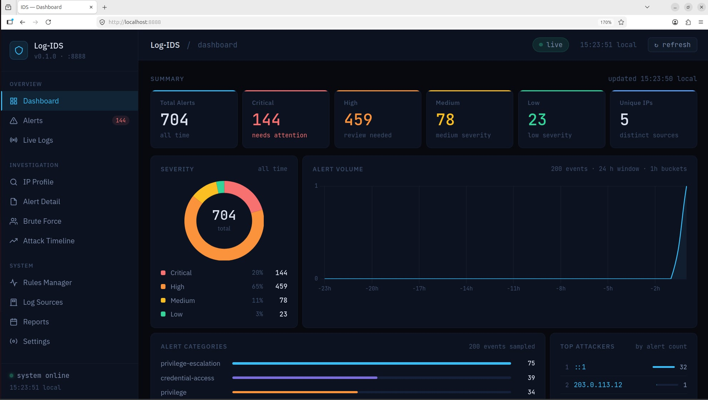
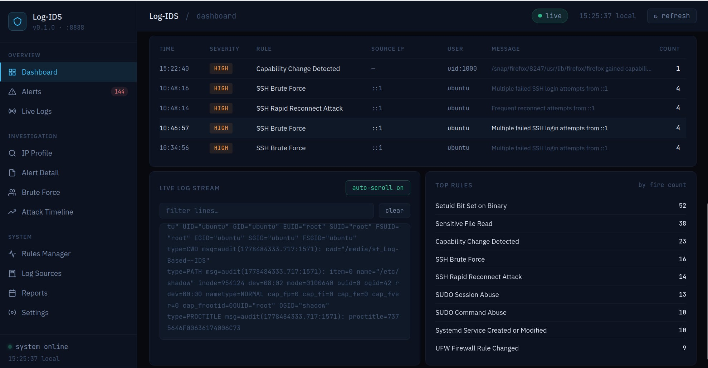
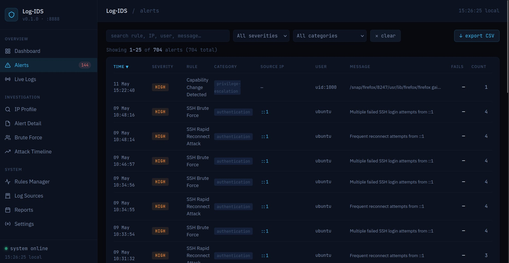
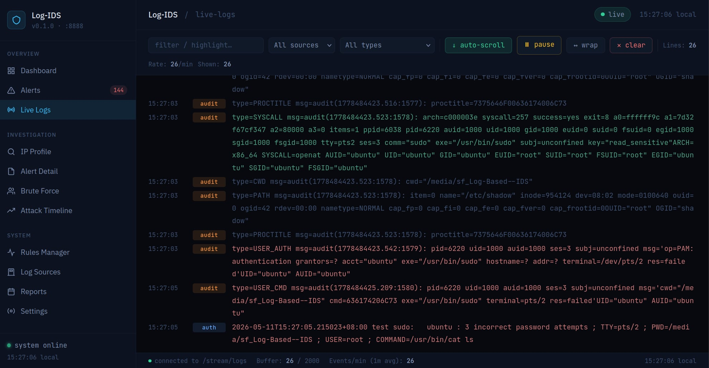
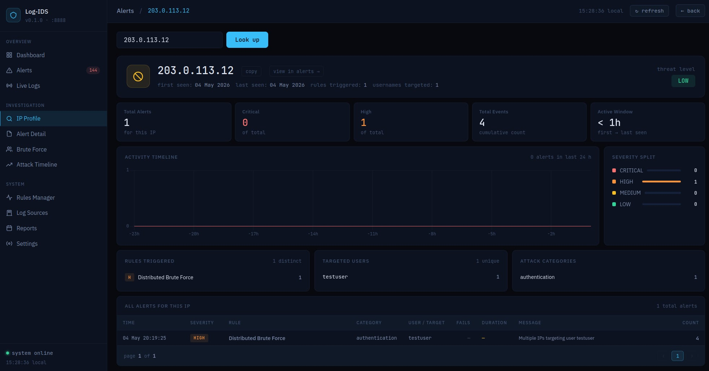
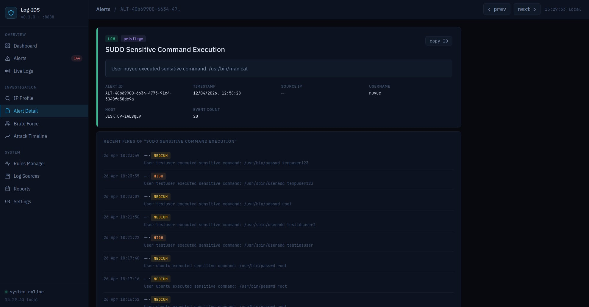
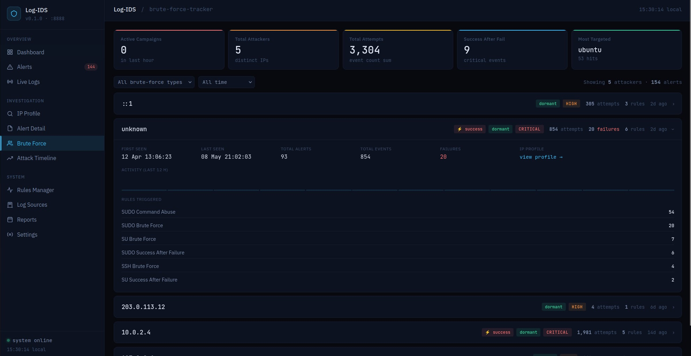
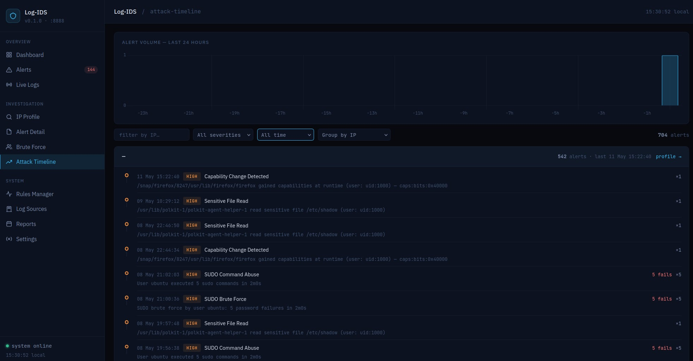
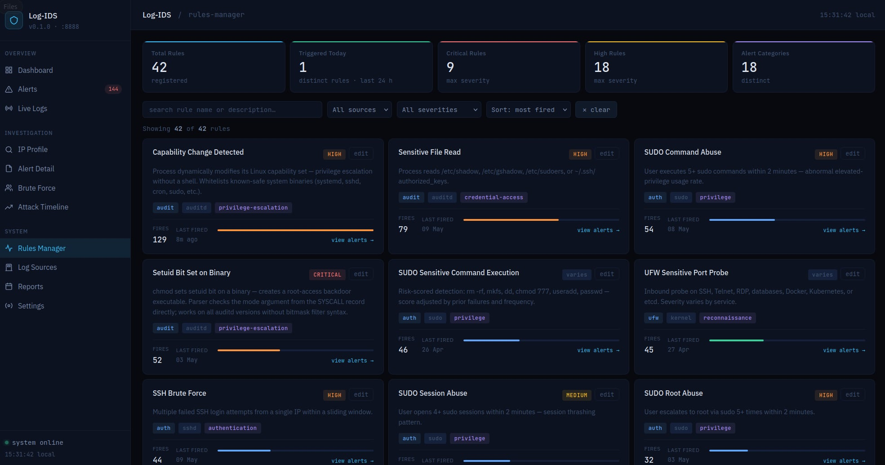
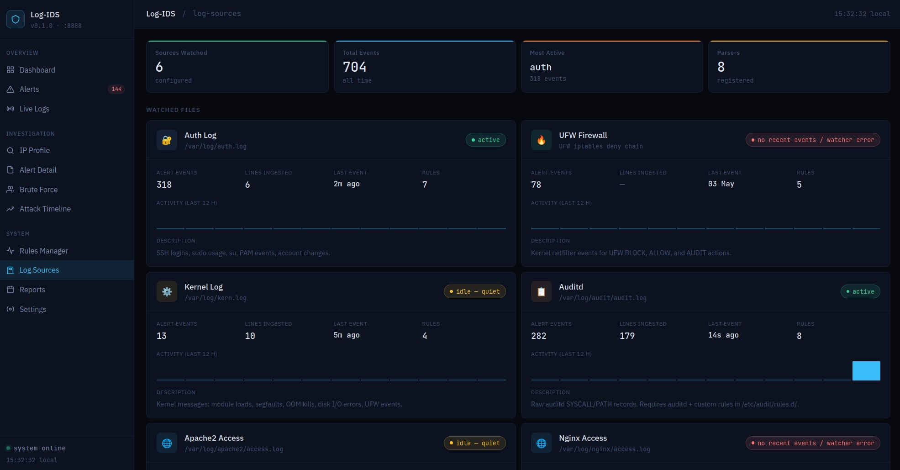
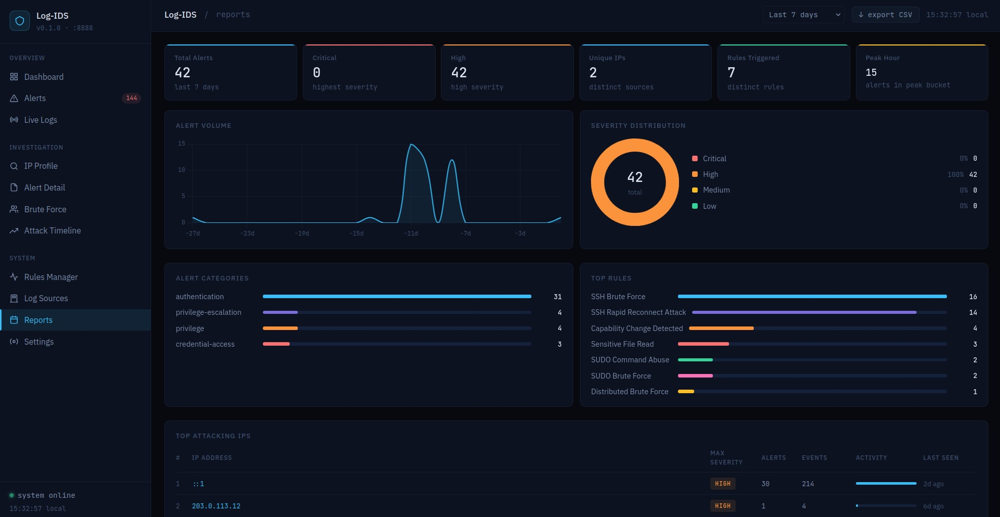
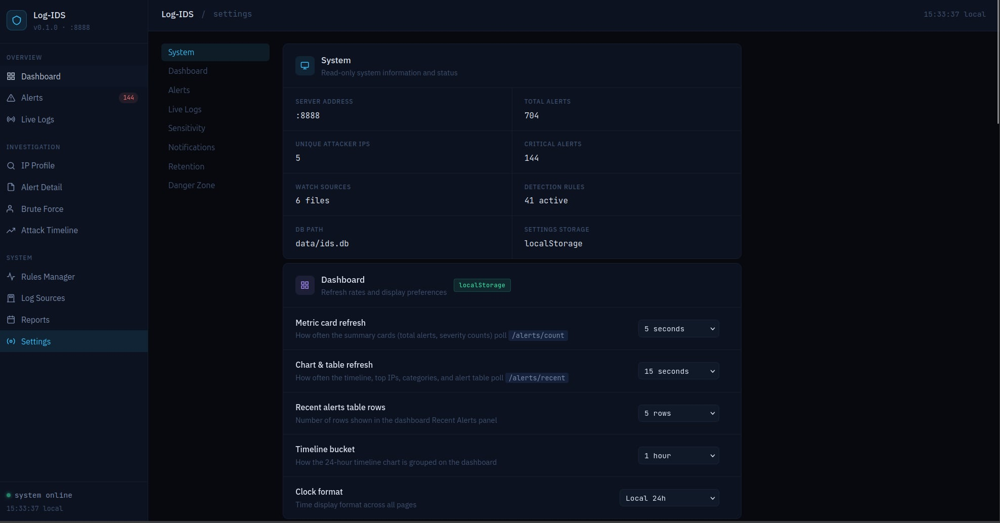


---


## Detection Coverage

41 rules across 6 log sources.

### SSH (source: auth)
| Rule | Severity | Trigger |
|------|----------|---------|
| SSH Brute Force | HIGH | 5+ failed attempts from one IP in 2 min |
| SSH Username Enumeration | HIGH | 5+ distinct usernames tried from one IP in 3 min |
| SSH Suspicious Login | CRITICAL | Success after 3+ failures in 5 min |
| Invalid User Brute Force | MEDIUM | 5+ attempts for non-existent users in 2 min |
| SSH Rapid Reconnect Attack | HIGH | 3+ disconnect-reconnect cycles in 2 min |
| SSH Root Targeting | HIGH | Any failed attempt against the root account |
| Distributed Brute Force | HIGH | 3+ distinct IPs targeting the same username in 3 min |

### Sudo (source: auth)
| Rule | Severity | Trigger |
|------|----------|---------|
| SUDO Brute Force | HIGH | 5+ wrong sudo passwords in 2 min |
| SUDO Success After Failure | HIGH | sudo succeeds after 3+ failures in 5 min |
| SUDO Sensitive Command Execution | varies | Risk-scored: `rm -rf`, `mkfs`, `dd`, `useradd`, `passwd` |
| SUDO Command Abuse | HIGH | 5+ sudo commands in 2 min |
| SUDO Root Abuse | HIGH | 5+ root escalations in 2 min |
| SUDO Session Abuse | MEDIUM | 4+ sudo sessions in 2 min |

### SU (source: auth)
| Rule | Severity | Trigger |
|------|----------|---------|
| SU Brute Force | HIGH | 5+ failed su attempts in 2 min |
| SU Success After Failure | CRITICAL | su succeeds after 3+ failures in 5 min |

### Account changes (source: auth)
| Rule | Severity | Trigger |
|------|----------|---------|
| New Account Created | HIGH | New local user added |
| Group Membership Changed | CRITICAL/MEDIUM | Added to sudo/wheel/docker/shadow (CRITICAL) or any group (MEDIUM) |
| Password Changed | CRITICAL/MEDIUM | root/daemon account (CRITICAL) or any account (MEDIUM) |

### UFW / Firewall (source: NFLOG)
| Rule | Severity | Trigger |
|------|----------|---------|
| UFW Port Scan Detected | HIGH | 6+ distinct ports from one IP in 1 min |
| UFW Repeated Block | MEDIUM | 20+ blocks from one IP in 2 min |
| UFW Block Storm | CRITICAL | 200+ total blocks across all IPs in 1 min |
| UFW Sensitive Port Probe | varies | SSH, Telnet, RDP, databases, Docker, Kubernetes probed |
| UFW Suspicious Outbound Block | CRITICAL | Outbound attempt to C2/backdoor/mining ports (Metasploit, Tor, IRC, mining) |

### Kernel (source: kern)
| Rule | Severity | Trigger |
|------|----------|---------|
| Kernel Module Load | CRITICAL | Out-of-tree or unsigned module loaded |
| Sensitive Binary Segfault | HIGH | sshd, sudo, su, passwd, or systemd crashes |
| OOM Kill Detected | HIGH/MEDIUM | OOM killer fires (HIGH for critical services) |
| Disk I/O Errors Detected | HIGH/MEDIUM | Block device accumulates I/O errors |

### Auditd (source: audit)
| Rule | Severity | Trigger |
|------|----------|---------|
| Sensitive File Read | HIGH | /etc/shadow, /etc/sudoers, authorized_keys read by untrusted process |
| Sensitive File Modified | CRITICAL | /etc/passwd, /etc/shadow, /root/.ssh written |
| Cron Job Created or Modified | HIGH | Write to any cron directory or /etc/crontab |
| Systemd Service Created or Modified | CRITICAL | Unit file written to system directories |
| Setuid Bit Set on Binary | CRITICAL | chmod sets setuid bit on any binary |
| Ptrace Syscall Detected | CRITICAL | Any process calls ptrace |
| Capability Change Detected | HIGH/CRITICAL | Process modifies its Linux capability set |
| Execution from Temp Directory | CRITICAL/HIGH | Binary executed from /tmp or /dev/shm (CRITICAL if write preceded it) |
| UFW Firewall Rule Changed | CRITICAL/HIGH | UFW config files modified directly |

### Web attacks (source: apache2 / nginx)
| Rule | Severity | Trigger |
|------|----------|---------|
| Web Scanner Detected | HIGH | Known scanner user-agent (Nikto, sqlmap, Gobuster, Nuclei, Burp…) |
| Web Path Probe | CRITICAL/HIGH | RCE, SQL injection, XSS, or traversal patterns in URI |
| Web Path Enumeration | MEDIUM | 15+ HTTP 404 responses from one IP in 1 min |
| Web Login Brute Force | HIGH | 5+ HTTP 401/403 responses to one IP in 3 min |
| Unusual HTTP Method | HIGH/MEDIUM | TRACE, CONNECT, OPTIONS, PUT, DELETE, PATCH |
| High Request Rate | HIGH/MEDIUM | 100+ requests/min (MEDIUM) or 500+ requests/min (HIGH) from one IP |

---

## Enabling Audit Rules

The auditd rules are installed automatically by `install.sh`. This section covers manual installation and verification.

### Verify rules are loaded

```bash
sudo auditctl -l | grep -E "key=(read_sensitive|write_sensitive|cron_write|service_write|setuid_binary|ptrace|capset|exec_tmp|tmp_write|ufw_change)"
```

Each active rule prints one line. If the output is empty, the rules are not loaded.

### Manual (re)installation

```bash
sudo cp /opt/ids/configs/auditd/ids.rules /etc/audit/rules.d/ids.rules
sudo augenrules --load
sudo systemctl restart auditd
```

### What each audit key covers

| Key | Detection rule | Severity |
|-----|---------------|----------|
| `read_sensitive` | Sensitive File Read | HIGH |
| `write_sensitive` | Sensitive File Modified | CRITICAL |
| `cron_write` | Cron Job Created or Modified | HIGH |
| `service_write` | Systemd Service Created or Modified | CRITICAL |
| `setuid_binary` | Setuid Bit Set on Binary | CRITICAL |
| `ptrace` | Ptrace Syscall Detected | CRITICAL |
| `capset` | Capability Change Detected | HIGH/CRITICAL |
| `exec_tmp` | Execution from Temp Directory | HIGH/CRITICAL |
| `tmp_write` | Write side of temp dropper correlation | — |
| `ufw_change` | UFW Firewall Rule Changed | CRITICAL/HIGH |

---

## Simulating Attacks

All simulation scripts are installed to `/opt/ids/scripts/simulate/`. Run them on the IDS machine to verify each detection category works.

### SSH brute force

```bash
# Triggers: SSH Brute Force, Root Targeting, Username Enumeration, Rapid Reconnect
bash /opt/ids/scripts/simulate/ssh_bruteforce.sh
```

### Sudo failures

```bash
# Triggers: SUDO Brute Force, Success After Failure, Command Abuse, Sensitive Command
# IMPORTANT: run as your normal non-root sudo user, not as root
bash /opt/ids/scripts/simulate/sudo_fail.sh
```

### SU failures

```bash
# Triggers: SU Brute Force, SU Success After Failure
bash /opt/ids/scripts/simulate/su_fail.sh
```

### Web attacks

```bash
# Requires: Apache2 running, curl installed
# Triggers: Web Scanner, Path Probe, 404 Enumeration, Auth Brute Force, Unusual Methods
bash /opt/ids/scripts/simulate/web_scanner.sh
```

### Audit — setuid backdoor

```bash
# Requires: auditd running with ids.rules loaded, run as root
# Triggers: Setuid Bit Set on Binary (CRITICAL)
sudo bash /opt/ids/scripts/simulate/audit_setuid.sh
```

### Audit — temp directory dropper

```bash
# Requires: auditd running with ids.rules loaded
# Triggers: Execution from Temp Directory (CRITICAL for dropper, HIGH for exec-only)
bash /opt/ids/scripts/simulate/audit_tmp_exec.sh
```

### UFW port scan

```bash
# Requires: UFW active, IDS service running, nmap or nc installed
# Must use the machine's LAN IP — 127.0.0.1 bypasses UFW
bash /opt/ids/scripts/simulate/ufw_portscan.sh $(hostname -I | awk '{print $1}')
```

---

## Configuration

All configuration is done through environment variables with safe built-in defaults. No config file is required for normal use.

### Changing a setting

```bash
# Open a systemd override file for the service
sudo systemctl edit ids-agent
```

Add your changes under `[Service]` in the editor that opens:

```ini
[Service]
Environment="IDS_ADDR=127.0.0.1:8888"
Environment="IDS_DB=/opt/ids/data/ids.db"
```

Save and apply:

```bash
sudo systemctl daemon-reload
sudo systemctl restart ids-agent
```

### Available variables

| Variable | Default | Description |
|----------|---------|-------------|
| `IDS_ADDR` | `127.0.0.1:8888` | HTTP listen address. Do not change to `0.0.0.0` without authentication. |
| `IDS_DB` | `data/ids.db` | SQLite database path. Relative paths resolve from `/opt/ids/`. |
| `IDS_LOG_AUTH` | `/var/log/auth.log` | Auth log (SSH, sudo, su, account events) |
| `IDS_LOG_KERN` | `/var/log/kern.log` | Kernel log (segfaults, OOM, module loads) |
| `IDS_LOG_AUDIT` | `/var/log/audit/audit.log` | Auditd log |
| `IDS_LOG_APACHE` | `/var/log/apache2/access.log` | Apache2 access log (optional) |
| `IDS_LOG_NGINX` | `/var/log/nginx/access.log` | Nginx access log (optional) |

### Dashboard settings

Retention period, max alert rows, webhook URL, detection sensitivity, and clock format are configured through the Settings page at `http://127.0.0.1:8888/settings.html` and stored in the database. These take effect immediately without restarting the service.

---

## Uninstalling

```bash
# From the project directory (preserves the alert database)
sudo bash uninstall.sh

# Remove everything including the database
sudo bash uninstall.sh --purge
```

The uninstall script stops the service (cleanly removing NFLOG rules), disables it, removes the unit file, removes the auditd rules, removes the desktop launcher, and removes the installation directory.

---

## Known Limitations

**Requires Linux with NFLOG support.**
The firewall collector uses the kernel netfilter NFLOG facility and requires Linux. A no-op stub is included so the code compiles on non-Linux systems, but firewall rules produce no alerts.

**Audit detections require auditd with the IDS rules loaded.**
Without `/etc/audit/rules.d/ids.rules` active, the kernel does not emit the records the IDS parses. The installer handles this automatically. Verify with `sudo auditctl -l | grep ids`.

**Web detections require a running web server.**
The IDS watches Apache2 and Nginx access logs. If neither is installed the log files do not exist and no web alerts fire. The service logs a warning at startup and continues normally.

**The live log stream is not persisted.**
The Live Logs page shows a real-time stream. Lines are not stored — navigating away or refreshing clears the view. All triggered alerts are always stored in the database.

**The dashboard has no authentication.**
It is bound to `127.0.0.1` by default. Do not expose port 8888 to the network without adding authentication — the dashboard exposes raw log lines and includes destructive endpoints (delete all alerts, prune by date).

**Timestamps in auth.log and kern.log omit the year.**
The parser injects the current year. Entries spanning a year boundary (December logs read in January) may have incorrect timestamps, causing detection windows to behave unexpectedly for those entries.

**The service must be stopped cleanly.**
Always use `sudo systemctl stop ids-agent`. Using `kill -9` skips the NFLOG iptables cleanup. See [Managing the Service](#managing-the-service) for manual cleanup instructions if this happens.

**Rule configuration changes take up to 10 seconds to apply.**
The detection engine caches rule overrides with a 10-second TTL. Changes made in the Rules Manager are reflected within 10 seconds without restarting the service. Global sensitivity changes (Settings page) invalidate the cache immediately.
